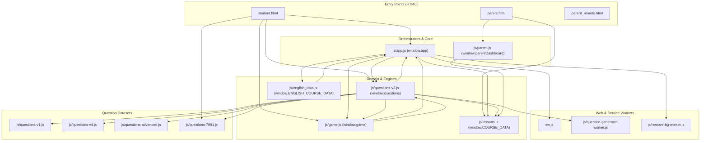

# FRONTEND DEPENDENCY MAP & HIGH-RISK LINK AUDIT

> **DỰ ÁN:** HocTap - Hệ thống Học tập & Thi trắc nghiệm AI (Toán & Tiếng Anh)  
> **PHIÊN BẢN ĐÓNG BĂNG:** v13.56  
> **NGÀY LẬP:** 31/08/2026  
> **TRẠNG THÁI:** CONTRACT FREEZE (CHỈ ĐỌC / BẢO VỆ NGUYÊN TRẠNG - TUYỆT ĐỐI KHÔNG TỰ Ý PHÁ VỠ)

---

## 1. PHÂN LOẠI MÔ-ĐUN & TỆP TIN (FILE CLASSIFICATION)

| Tệp tin | Phân loại vai trò | Trách nhiệm kiến trúc |
| :--- | :--- | :--- |
| `student.html` | **Entry Point / UI Shell** | Vỏ giao diện chính của học sinh, chứa toàn bộ khung DOM modal/overlay/screen. |
| `parent.html` | **Entry Point / UI Shell** | Bảng điều khiển phụ huynh tại chỗ với giao diện Tailwind CSS. |
| `parent_remote.html` | **Entry Point / UI Shell** | Bảng điều khiển phụ huynh từ xa qua Firebase Realtime Database. |
| `sw.js` | **Infrastructure / PWA Worker** | Quản lý bộ đệm PWA theo chiến lược Network-First, fallback offline. |
| `js/app.js` | **Orchestrator / State Manager** | Điều phối toàn cục: Điều hướng màn hình, Audio, TTS, Quiz runner, Cloud sync, Auth session. |
| `js/game.js` | **Game Engine / Domain** | Động cơ Game Tower Defense 2D Canvas (Hero, Tower, Monster, Wave, Skills). |
| `js/parent.js` | **Orchestrator / Domain** | Quản trị Dashboard phụ huynh: Auth PIN, Chart rendering, Cấu hình học sinh, API key. |
| `js/lessons.js` | **Data / Domain** | Dữ liệu cấu trúc môn Toán Lớp 6 (`COURSE_DATA`), danh mục môn học (`SYSTEM_SUBJECTS`), video. |
| `js/english_data.js` | **Data / Domain / Generator** | Dữ liệu bài học Tiếng Anh (`ENGLISH_COURSE_DATA`), bộ sinh câu hỏi trắc nghiệm Tiếng Anh. |
| `js/questions-v3.js` | **Domain / Engine / UI Runner**| Động cơ sinh câu hỏi Toán 6 (`questions`), Template Engine, KaTeX parser, Practice UI. |
| `js/questions-v1.js` | **Data / Generator** | Ngân hàng template câu hỏi Toán Lớp 1 (`questionsL1`). |
| `js/questions-v4.js` | **Data / Generator** | Ngân hàng template câu hỏi Toán Lớp 4 (`questionsL4`). |
| `js/questions-advanced.js` | **Data / Generator** | Bộ đề trắc nghiệm Toán nâng cao (`questionsAdvanced`). |
| `js/questions-7991.js` | **Data / Generator** | Bộ 100 câu hỏi ôn tập tổng hợp 7991 (`questions7991`). |
| `js/question-generator-worker.js` | **Worker / Domain** | Web Worker sinh câu hỏi Toán 6 ngầm để chống đơ giao diện main thread. |
| `js/remove-bg-worker.js` | **Worker / Utility** | Web Worker tẩy nền ảnh chân dung học sinh bằng BFS Flood Fill. |
| `js/lib/*` | **Infrastructure / Vendor** | Các thư viện ngoài: SweetAlert2, KaTeX, Chart.js, Mermaid.js, Marked.js, Tailwind CSS. |

---

## 2. MA TRẬN PHỤ THUỘC TOÀN CỤC (GLOBAL DEPENDENCY MATRIX)

```
+-----------------------+-----+------+--------+-------------+-----------+--------------+--------------+
| CONSUMER \ PROVIDER   | app | game | parent | COURSE_DATA | questions | english_data | questionsL1-4|
+-----------------------+-----+------+--------+-------------+-----------+--------------+--------------+
| student.html          |  X  |  X   |        |             |     X     |              |      X       |
| parent.html           |     |      |   X    |      X      |           |              |              |
| parent_remote.html    |     |      |        |             |           |              |              |
| js/app.js             | Self|  X   |   X    |      X      |     X     |      X       |              |
| js/game.js            |  X  | Self |        |             |     X     |              |              |
| js/parent.js          |     |      |  Self  |      X      |           |              |              |
| js/questions-v3.js    |  X  |  X   |        |      X      |   Self    |              |      X       |
| js/english_data.js    |  X  |      |        |             |     X     |     Self     |              |
+-----------------------+-----+------+--------+-------------+-----------+--------------+--------------+
```

---

## 3. MERMAID DEPENDENCY GRAPH



---

## 4. DANH MỤC LIÊN KẾT NGUY HIỂM CAO (HIGH-RISK LINKS)

Mỗi liên kết mô tả nguy cơ gây sập ứng dụng nếu tệp tin bị di dời, đổi tên hoặc tách nhỏ không đồng bộ:

### Định dạng: `SOURCE → TARGET → MECHANISM → RISK`

1. **`student.html → window.app → inline onclick/onchange/onsubmit → CRITICAL`**
   - **Cơ chế:** 187 nút bấm, form và sự kiện DOM trong `student.html` gọi trực tiếp `app.<method>()`.
   - **Rủi ro:** Nếu `app` chưa hoàn tất khởi tạo hoặc phương thức bị đổi tên, toàn bộ giao diện học sinh sẽ tê liệt hoàn toàn.

2. **`js/questions-v3.js → window.app → Global Reference → HIGH`**
   - **Cơ chế:** `questions-v3.js` đọc trực tiếp `app.state.currentStudentId`, gọi `app.playSound()`, `app.showScreen()`, `app.saveProgress()`.
   - **Rủi ro:** Gây lỗi vòng lặp phụ thuộc (Circular Dependency) giữa bộ điều phối chính và bộ sinh câu hỏi.

3. **`js/app.js → window.questions → Global Reference → CRITICAL`**
   - **Cơ chế:** `app.js` gọi `questions.generateQuestionFromTemplate()`, `questions.startPracticeWithLevel()`, `questions.getDivisors()`.
   - **Rủi ro:** Toàn bộ tính năng thi và luyện tập môn Toán Lớp 6 phụ thuộc 100% vào việc `questions-v3.js` được nạp trước `app.js`.

4. **`js/game.js → window.app → Global Reference & State Mutation → HIGH`**
   - **Cơ chế:** Game đọc năng lượng từ `app.state.gameEnergy`, thưởng điểm cho học sinh qua `app.addGameEnergy()` và gọi `app.exitFreePlayGame()`.
   - **Rủi ro:** Khi chơi game ở chế độ độc lập hoặc thay đổi cấu trúc `app.state`, game sẽ crash ngay khi tiêu diệt quái vật hoặc kết thúc màn.

5. **`js/app.js → window.COURSE_DATA → Global Dataset Read → HIGH`**
   - **Cơ chế:** `app.js` duyệt danh mục chương, bài học và chủ đề từ biến toàn cục `COURSE_DATA` để render cây bài giảng.
   - **Rủi ro:** Nếu `lessons.js` bị lỗi cú pháp hoặc tải chậm, menu điều hướng học tập sẽ trống trơn.

6. **`js/app.js → window.ENGLISH_COURSE_DATA → Global Dataset Read → HIGH`**
   - **Cơ chế:** `app.js` duyệt cây bài học Tiếng Anh từ `ENGLISH_COURSE_DATA`.
   - **Rủi ro:** Làm hỏng toàn bộ phân hệ học Tiếng Anh của cả 3 khối lớp (Lớp 1, 4, 6).

7. **`js/questions-v3.js → window.game → Global Reference → MEDIUM`**
   - **Cơ chế:** `questions-v3.js` kích hoạt chọn tướng Tower Defense thông qua `game.setHero()`.
   - **Rủi ro:** Nếu game chưa nạp xong, modal chọn tướng sẽ báo lỗi `game is undefined`.

8. **`js/questions-v3.js → js/question-generator-worker.js → Web Worker Message → HIGH`**
   - **Cơ chế:** Main thread chuyển danh sách template sang Worker qua `postMessage` và nhận kết quả qua `onmessage`.
   - **Rủi ro:** Lỗi serialize hàm (DataCloneError) nếu template chứa function hoặc closure không được làm sạch trước khi gửi.

9. **`js/parent.js → window.COURSE_DATA → Global Reference → HIGH`**
   - **Cơ chế:** Bảng điều khiển phụ huynh đọc cấu trúc chương bài từ `COURSE_DATA` để ánh xạ mã bài học sang tên hiển thị trên biểu đồ.
   - **Rủi ro:** Phụ huynh sẽ thấy mã bài học thô (ví dụ: `bai_01`) thay vì tên bài học tiếng Việt chuẩn nếu thiếu `lessons.js`.

10. **`student.html → Google Identity SDK (`accounts.google.com`) → Network Dependency → HIGH`**
    - **Cơ chế:** Nạp script ngoài từ CDN Google để phục vụ đăng nhập.
    - **Rủi ro:** Ở chế độ Offline Kiosk không có mạng Internet, script không tải được; code phải kích hoạt fallback `skipGoogleLogin`.

---

## 5. TOP 20 DEPENDENCY NGUY HIỂM NHẤT (RANKED 1 - 20)

| Hạng | Phụ thuộc Nguồn → Đích | Cơ chế phụ thuộc | Mức độ rủi ro | Hậu quả khi lỗi |
| :---: | :--- | :--- | :---: | :--- |
| **1** | `student.html → window.app` | DOM Inline Event Handlers (187 điểm) | **CRITICAL** | Giao diện học sinh tê liệt 100%. |
| **2** | `js/app.js → window.questions` | Khởi tạo bài tập & thi trắc nghiệm | **CRITICAL** | Không thể mở bất kỳ bài thi hay luyện tập Toán nào. |
| **3** | `js/questions-v3.js → window.app` | Ghi nhận kết quả, phát âm thanh, chuyển màn hình | **CRITICAL** | Nộp bài thi bị crash, không lưu được điểm số. |
| **4** | `js/app.js → window.COURSE_DATA` | Kết xuất mục lục & cấu trúc bài học | **HIGH** | Mất toàn bộ cây danh mục bài giảng môn Toán. |
| **5** | `js/app.js → window.ENGLISH_COURSE_DATA` | Kết xuất bài học & sinh đề Tiếng Anh | **HIGH** | Mất toàn bộ nội dung môn Tiếng Anh Lớp 1, 4, 6. |
| **6** | `js/questions-v3.js → Worker` | Sinh câu hỏi ngầm đa luồng qua Worker | **HIGH** | Đơ giao diện học sinh hoặc sập worker do DataCloneError. |
| **7** | `js/game.js → window.app` | Đọc/ghi `gameEnergy` và nhận thưởng | **HIGH** | Game Tower Defense crash khi tiêu diệt quái vật hoặc hết giờ. |
| **8** | `js/parent.js → window.COURSE_DATA` | Ánh xạ tên bài học trên biểu đồ phụ huynh | **HIGH** | Biểu đồ phụ huynh mất nhãn bài học tiếng Việt. |
| **9** | `js/questions-v3.js → questionsL1` | Sinh đề toán lớp 1 cho Trần Bảo Ngọc | **HIGH** | Học sinh Lớp 1 không thể làm bài tập toán. |
| **10**| `js/questions-v3.js → questionsL4` | Sinh đề toán lớp 4 cho Trần Đức Phúc | **HIGH** | Học sinh Lớp 4 không thể làm bài tập toán. |
| **11**| `js/app.js → window.safeStorage` | Truy xuất LocalStorage an toàn | **HIGH** | Crash toàn trang trên trình duyệt ẩn danh hoặc khi đầy bộ nhớ. |
| **12**| `js/app.js → DOM: #splash-screen` | Điều phối ẩn/hiện Splash Screen | **HIGH** | Ứng dụng kẹt vĩnh viễn ở màn hình Splash. |
| **13**| `js/app.js → DOM: #quiz-practice-screen` | Kết xuất giao diện làm bài tập | **HIGH** | Trắng màn hình khi bấm vào bài học. |
| **14**| `js/parent.js → DOM: #progressChart` | Khởi tạo đối tượng biểu đồ Chart.js | **HIGH** | Bảng điều khiển phụ huynh báo lỗi JS và không hiển thị thống kê. |
| **15**| `js/app.js → /api/load-progress` | Nạp tiến độ học tập từ SQLite Server | **HIGH** | Mất toàn bộ điểm số, sao vàng và cấp độ của học sinh. |
| **16**| `js/app.js → /api/save-progress` | Lưu tiến độ học tập về SQLite Server | **HIGH** | Học sinh làm bài xong không được ghi nhận kết quả. |
| **17**| `parent.html → /api/admin/login` | Xác thực mã PIN phụ huynh | **HIGH** | Phụ huynh bị khóa bên ngoài bảng điều khiển. |
| **18**| `js/app.js → window.Swal` | Hiển thị hộp thoại thông báo và xác nhận | **MEDIUM** | Mất toàn bộ dialogs tương tác khi nộp bài hoặc thoát ứng dụng. |
| **19**| `js/app.js → window.katex` | Kết xuất công thức toán học LaTeX | **MEDIUM** | Công thức toán học bị hiển thị dạng mã thô ($...$). |
| **20**| `student.html → sw.js` | Đăng ký Service Worker lưu cache PWA | **MEDIUM** | Mất khả năng hoạt động khi mất kết nối mạng (Offline). |

---

## 6. CÁC ĐIỂM TÁCH GHÉP AN TOÀN (REFACTOR SEAMS)

Mặc dù giữ nguyên tắc **KHÔNG REFACTOR** ở giai đoạn hiện tại, bản đồ này xác định 5 điểm tách ghép có thể thực hiện an toàn trong tương lai mà không phá vỡ hợp đồng công khai:

### Seam 1: Bộ tách phát âm thanh & Giọng đọc (Audio & Speech Service)
- **Trách nhiệm:** Phát file âm thanh hiệu ứng (`sounds/*.mp3`) và Web Speech Synthesis.
- **Vị trí hiện tại:** Nằm rải rác bên trong `js/app.js` (`app.playSound`, `app.speakText`).
- **Phụ thuộc:** Web Audio API, `SpeechSynthesis`.
- **Người tiêu dùng:** `js/app.js`, `js/questions-v3.js`, `js/game.js`.
- **Rủi ro:** THẤP (Không ảnh hưởng đến logic toán hay cơ sở dữ liệu).
- **Test tiên quyết:** Kiểm tra phát đầy đủ 12 loại âm thanh và giọng đọc tiếng Anh/Việt.

### Seam 2: Bộ lưu trữ an toàn (Safe Storage Layer)
- **Trách nhiệm:** Quản lý đọc/ghi `localStorage` và `sessionStorage` có try-catch và memory fallback.
- **Vị trí hiện tại:** Khai báo đầu tệp `js/app.js` (`safeStorage`).
- **Phụ thuộc:** Trình duyệt LocalStorage.
- **Người tiêu dùng:** `js/app.js`, `js/parent.js`, `js/questions-v3.js`.
- **Rủi ro:** THẤP.
- **Test tiên quyết:** Kiểm tra chạy trên Private Browsing Mode (Incognito).

### Seam 3: Bộ điều hợp API Client (API Adapter / HTTP Client)
- **Trách nhiệm:** Đóng gói hàm `fetch()` với logic tự động nhận diện cổng máy chủ, mã hóa JWT `adminToken` và xử lý lỗi mạng.
- **Vị trí hiện tại:** Các lệnh `fetch()` trực tiếp rải rác trong `js/app.js`, `js/parent.js`, `js/questions-v3.js`.
- **Phụ thuộc:** Fetch API, `window.location`.
- **Người tiêu dùng:** Toàn bộ các mô-đun frontend.
- **Rủi ro:** TRUNG BÌNH.
- **Test tiên quyết:** Bộ kiểm thử API endpoints tại `tests/api/*.test.js`.

### Seam 4: Bộ render công thức KaTeX & Markdown (Math & Markdown Parser)
- **Trách nhiệm:** Bọc gọn thư viện `katex` và `marked`, xử lý chuẩn hóa ký tự `$` tránh lỗi render KaTeX.
- **Vị trí hiện tại:** Nằm trong `js/questions-v3.js` và `js/app.js`.
- **Phụ thuộc:** `katex.min.js`, `auto-render.min.js`, `marked.min.js`.
- **Người tiêu dùng:** `questions`, `app` (AI chat).
- **Rủi ro:** TRUNG BÌNH.
- **Test tiên quyết:** Kiểm thử render 100 câu hỏi mẫu không lỗi LaTeX.

### Seam 5: Bộ điều phối Game Tower Defense (Game Bridge)
- **Trách nhiệm:** Làm cầu nối trung gian giữa `app.state` (năng lượng, học sinh, điểm thưởng) và `game.js`.
- **Vị trí hiện tại:** Gọi trực tiếp qua biến toàn cục `window.game` và `window.app`.
- **Phụ thuộc:** `app.state`, `game`.
- **Người tiêu dùng:** `student.html`, `js/app.js`, `js/questions-v3.js`.
- **Rủi ro:** TRUNG BÌNH.
- **Test tiên quyết:** Chơi thử một màn game tự do 15 phút và nhận thưởng sao vàng.
