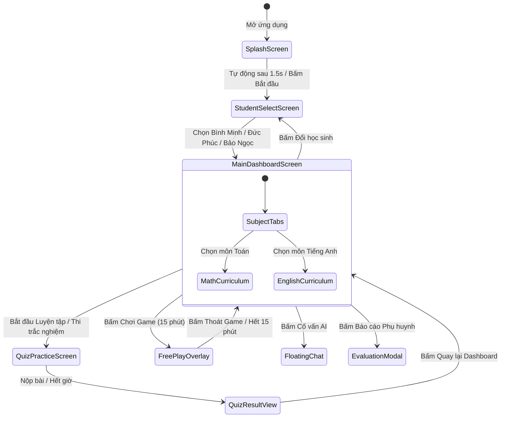
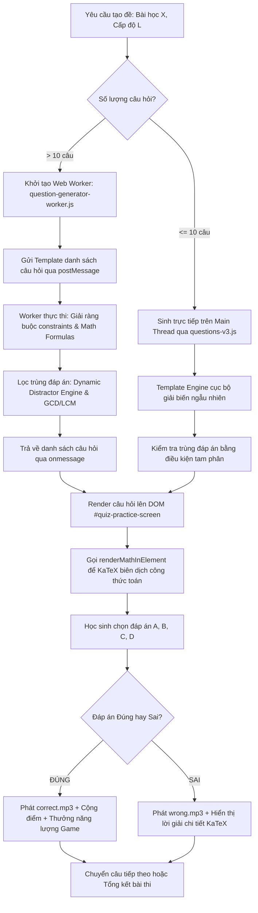
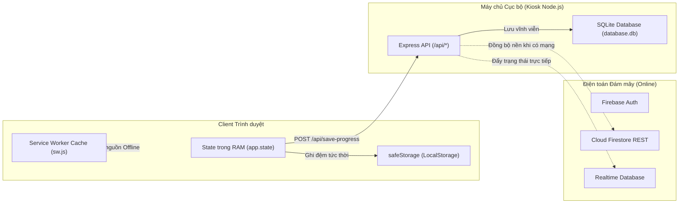
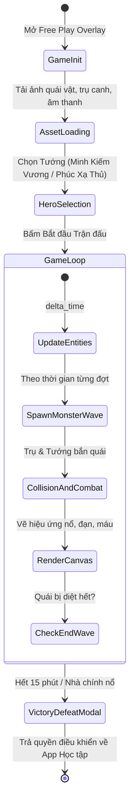

# FRONTEND RUNTIME MAP & EXECUTION LIFECYCLE

> **DỰ ÁN:** HocTap - Hệ thống Học tập & Thi trắc nghiệm AI (Toán & Tiếng Anh)  
> **PHIÊN BẢN ĐÓNG BĂNG:** v13.56  
> **NGÀY LẬP:** 31/08/2026  
> **TRẠNG THÁI:** RUNTIME MAP (SƠ ĐỒ VÒNG ĐỜI & LUỒNG THỰC THI THỜI GIAN THỰC)

---

## 1. VÒNG ĐỜI KHỞI ĐỘNG ỨNG DỤNG (APPLICATION BOOTSTRAP SEQUENCE)

Quy trình khởi động của ứng dụng từ lúc trình duyệt mở `student.html` diễn ra theo 7 giai đoạn kế tiếp:

```mermaid
sequenceDiagram
    autonumber
    actor User as Học sinh / Phụ huynh
    participant Browser as Trình duyệt (student.html)
    participant Precheck as Inline Precheck & Error Boundary
    participant Libs as Vendor Libs (KaTeX, Swal, Chart)
    participant App as app.js (window.app)
    participant Server as Express Server (Local/Kiosk)
    participant SW as Service Worker (sw.js)

    User->>Browser: Mở student.html (hoặc PWA Kiosk)
    Browser->>Precheck: Kiểm tra ES6+, Optional Chaining & window.onerror
    Browser->>Libs: Tải SweetAlert2, KaTeX, Chart.js, Mermaid.js
    Browser->>SW: Đăng ký Service Worker (Network-First Precache)
    Browser->>App: DOMContentLoaded / window.onload trigger app.init()
    
    rect rgb(20, 30, 45)
        Note over App,Server: Giai đoạn nhận diện môi trường & kết nối máy chủ
        App->>Server: GET /api/is-kiosk-mode
        Server-->>App: { isKiosk: boolean }
        App->>Server: GET /api/auth/google-client-id
        Server-->>App: { clientId: string }
        App->>Server: GET /api/load-config?studentId=default
        Server-->>App: { config: object }
    end

    App->>Browser: Hiển thị Splash Screen (#splash-screen)
    App->>App: Phát âm thanh chào mừng startup.mp3 (nếu chưa tắt)
    App->>Browser: Chuyển sang màn hình Chọn học sinh (#student-select-screen)
```

---

## 2. MÁY TRẠNG THÁI ĐIỀU HƯỚNG GIAO DIỆN (NAVIGATION STATE MACHINE)

Toàn bộ quá trình chuyển màn hình được điều phối tập trung thông qua hàm `app.showScreen(screenId)` và ngăn xếp `app.state.navigationHistory`:

---

## 3. LUỒNG SINH ĐỀ THI & CÂU HỎI TRẮC NGHIỆM (QUIZ & QUESTION GENERATION PIPELINE)

Hệ thống hỗ trợ 2 chế độ sinh câu hỏi: **Sinh ngầm đa luồng qua Web Worker** (cho đề lớn 20-50 câu) và **Sinh trực tiếp trên Main Thread** (cho bài luyện tập ngắn):

---

## 4. LUỒNG ĐỒNG BỘ DỮ LIỆU & LƯU TRỮ OFFLINE (DATA PERSISTENCE FLOW)

Kiến trúc **Local-First** đảm bảo ứng dụng luôn chạy 100% khi mất mạng Internet:

---

## 5. VÒNG ĐỜI TRÒ CHƠI TOWER DEFENSE (GAME RUNTIME LIFECYCLE)

Game Tower Defense được tích hợp sẵn trong client để tạo động lực học tập cho học sinh:

