# TÀI LIỆU KIẾN TRÚC HỆ THỐNG HIỆN TẠI (v13.38)

**Tên dự án**: HỌCTẬP — Kiosk & Học trực tuyến Toán - Tiếng Anh  
**Phiên bản**: v13.38 (Cập nhật: 30/08/2026 16:30)  
**Mô hình kiến trúc**: Modular Monolith / Clean Architecture / Event-Driven SPA / Canonical Data Source  

---

## 1. TỔNG QUAN CÁC TẦNG KIẾN TRÚC (ARCHITECTURAL LAYERS)

```mermaid
graph TD
    subgraph UI_Layer["1. Presentation & UI Layer"]
        HTML["student.html / parent.html"]
        CSS["css/style.css"]
        Modules["js/modules/*.module.js (11 modules)"]
        Features["js/features/*.js (10 services)"]
    end

    subgraph Facade_Layer["2. Façade & Coordination Layer"]
        AppJS["js/app.js (Master Façade - 52 methods)"]
        EventBus["js/core/event-bus.js (Central Event Hub)"]
        Nav["js/core/navigation.js (Screen Switcher)"]
        State["js/core/state.js (Reactive Store)"]
        Storage["js/core/storage.js (LocalStorage & Persistence)"]
        APIClient["js/core/api-client.js (HTTP/REST Client)"]
        LazyLoader["js/core/lazy-loader.js (On-Demand Engine Loader)"]
    end

    subgraph Engine_Layer["3. Engine & Computational Core"]
        QEngine["js/engine/question-engine.js (Engine v3.0)"]
        Workers["js/question-generator-worker.js & remove-bg-worker.js"]
    end

    subgraph Canonical_Data["4. Canonical Data Sources (Single Source of Truth)"]
        MathG1["data/grade_1/math/generator.js"]
        MathG4["data/grade_4/math/generator.js"]
        MathG6["data/grade_6/math/generator.js"]
        Math7991["data/grade_6/math/exam7991.js"]
        MathAdv["data/grade_6/math/advanced.js"]
        MathJSON["data/math/grade6/*.json (5 chapters)"]
        EngG1["data/grade_1/english/lessons.js"]
        EngG4["data/grade_4/english/lessons.js"]
        EngG6["data/grade_6/english/lessons.js"]
        EngData["js/english_data.js (Dynamic Generator)"]
        Lessons["js/lessons.js (Math Structure)"]
    end

    subgraph Backend_Layer["5. Backend & Server Layer"]
        Express["server.js (Express REST API)"]
        Controllers["server/controllers/*.ts"]
        Services["server/services/*.ts (AI Gemini Client, Scoring)"]
        Database["server/db/database.ts (SQLite3 WAL Mode)"]
    end

    subgraph PWA_Offline["6. Offline & Distribution"]
        SW["sw.js (PWA Service Worker v13.38)"]
        Kiosk["kiosk_lock.exe / kiosk_lock.cs"]
    end

    HTML --> AppJS
    Modules --> EventBus
    AppJS --> Modules
    AppJS --> Features
    AppJS --> Nav
    Features --> QEngine
    QEngine --> MathJSON
    QEngine --> MathG6
    Modules --> EngData
    EngData --> EngG1
    EngData --> EngG4
    EngData --> EngG6
    APIClient --> Express
    Express --> Controllers
    Controllers --> Services
    Services --> Database
```

---

## 2. QUY CHUẨN ĐIỀU PHỐI (ORCHESTRATION RULES)

1. **HTML Events**: Tất cả sự kiện `onclick`, `onchange`, `oninput` trên giao diện HTML gọi trực tiếp qua đối tượng `app.*` (ví dụ: `onclick="app.enterApp()"`).
2. **Façade Dispatch**: `js/app.js` nhận lệnh và ủy quyền (delegate) sang đúng Service hoặc Module tương ứng:
   - Điều hướng màn hình: Gọi `NavigationService.showScreen(name)`.
   - Âm thanh: Gọi `AudioService.playClick()`, `AudioService.playCorrect()`.
   - Sinh câu hỏi: Gọi `QuestionEngine` hoặc `CurriculumModule`.
   - Trạng thái: Phát sự kiện qua `EventBus.emit(event, data)`.
3. **Nguồn Dữ liệu Chuẩn (Canonical Sources)**:
   - Mỗi môn học và khối lớp có đúng 1 tệp nguồn dữ liệu duy nhất trong thư mục `data/grade_*`.
   - Tuyệt đối không tạo tệp sao chép hoặc tệp bọc (wrapper/adapter) thừa thãi.
4. **Offline & Caching**:
   - `sw.js` tự động cache toàn bộ static assets quan trọng với chiến lược Cache-First.
   - Các API tương tác điểm số và trạng thái áp dụng chiến lược Network-First với fallback LocalStorage.
