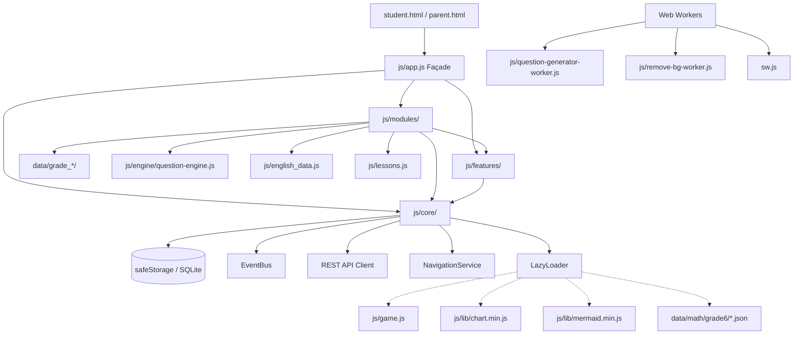

# DEPENDENCY GRAPH — HOC TAP ECOSYSTEM
**Phiên bản:** v13.38  
**Thời gian lập:** 30/08/2026 16:30  

---

## 1. SƠ ĐỒ LUỒNG PHỤ THUỘC TỔNG THỂ

---

## 2. MA TRẬN PHỤ THUỘC GIỮA CÁC MODULES & SERVICES

| Module / Service | Phụ Thuộc Cốt Lõi (Core Dependencies) | Phụ Thuộc Dịch Vụ (Feature Dependencies) | Sự Kiện Đăng Ký / Phát Ra (EventBus) |
| :--- | :--- | :--- | :--- |
| **`js/app.js`** | `NavigationService`, `safeStorage`, `AppState`, `api-client` | Tất cả Features | `progress:loaded`, `progress:saved` |
| **`js/modules/splash.module.js`** | `AppState`, `NavigationService` | `AudioService`, `SpeechService` | `splash:ready` |
| **`js/modules/student-select.module.js`** | `AppState`, `NavigationService`, `safeStorage` | `AudioService` | `student:changed` |
| **`js/modules/curriculum.module.js`** | `AppState`, `NavigationService` | `KatexService`, `AudioService` | `student:changed`, `lesson:selected` |
| **`js/modules/quiz-runner.module.js`** | `AppState`, `NavigationService`, `safeStorage` | `AudioService`, `SpeechService`, `GamificationService`, `ScratchpadService` | `quiz:started`, `quiz:finished`, `xp:earned` |
| **`js/modules/vocab-monster.module.js`**| `AppState`, `NavigationService` | `AudioService`, `SpeechService`, `SrsService` | `vocab:mastered`, `monster:defeated` |
| **`js/modules/skill-card.module.js`** | `AppState`, `NavigationService`, `api-client` | `GamificationService`, `AudioService` | `card:unlocked`, `card:exchanged` |
| **`js/modules/leaderboard.module.js`** | `AppState`, `NavigationService`, `api-client` | `AudioService` | `presence:updated`, `leaderboard:refreshed` |
| **`js/modules/chat.module.js`** | `AppState`, `api-client` | `AudioService` | `chat:message_received` |
| **`js/modules/parent-dashboard.module.js`** | `AppState`, `NavigationService`, `api-client` | `KatexService` | `evaluation:generated` |
| **`js/features/gamification-service.js`** | `AppState`, `safeStorage` | `AudioService` | `xp:added`, `streak:increased`, `badge:unlocked` |
| **`js/features/srs-service.js`** | `AppState`, `safeStorage` | Không | `srs:item_reviewed`, `srs:box_upgraded` |
| **`js/features/audio-service.js`** | Web Audio API / AudioContext | Không | Không |
| **`js/features/speech-service.js`** | SpeechSynthesis / SpeechRecognition | Không | Không |

---

## 3. TRUY VẾT TÀI NGUYÊN NẠP ĐỘNG (DYNAMIC RUNTIME DEPENDENCIES)

1. **`LazyLoader.loadGameEngine()`**: Nạp động `js/game.js` khi học sinh khởi động minigame Thủ Thành Toán Học.
2. **`LazyLoader.loadMermaid()`**: Nạp `js/lib/mermaid.min.js` khi phụ huynh mở chế độ Sơ Đồ Tư Duy Bài Học.
3. **`LazyLoader.loadChart()`**: Nạp `js/lib/chart.min.js` khi mở Báo Cáo Năng Lực Học Sinh.
4. **`LazyLoader.loadQuestionBank(grade, chapter)`**: Nạp các tệp `data/math/grade6/*.json` theo từng chương học.
5. **`Worker('js/question-generator-worker.js')`**: Được khởi tạo bởi `data/grade_6/math/generator.js` để sinh ngẫu nhiên 50-100 câu hỏi trong luồng nền.
6. **`Worker('js/remove-bg-worker.js')`**: Được khởi tạo bởi `js/game.js` để xử lý xóa nền ảnh nhân vật.
