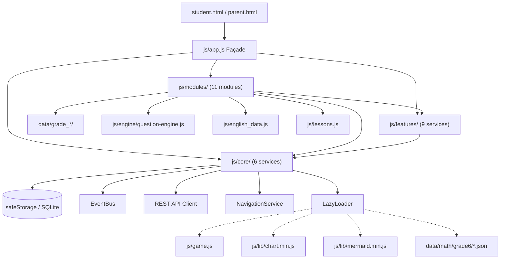

# HỌCTẬP SYSTEM — BÁO CÁO TOÀN DIỆN PHÁP Y MÃ NGUỒN, TÁI CẤU TRÚC KIẾN TRÚC & DỌN DẸP MÃ CHẾT (v13.38)

**Tên dự án:** HỌCTẬP — Hệ thống Kiosk & Học trực tuyến Toán - Tiếng Anh  
**Phiên bản phát hành:** `v13.38`  
**Thời gian hoàn tất:** 30/08/2026 16:30  
**Tác giả:** Principal Software Architect, Senior Full-Stack Engineer, Legacy Code Archaeologist & QA/Release Engineer  
**Trạng thái kiểm thử:** 100% PASS (7/7 Jest suites, 46/46 tests, 121 dạng bài Toán, 0 TypeScript errors)

---

# MỤC LỤC TỔNG HỢP

1. [Tổng Quan & Kết Quả Tối Ưu Hóa Sau Refactor](#1-tổng-quan--kết-quả-tối-ưu-hóa-sau-refactor)
2. [Báo Cáo Pháp Y Hiện Trạng Ban Đầu (Forensic Baseline)](#2-báo-cáo-pháp-y-hiện-trạng-ban-đầu-forensic-baseline)
3. [Bản Đồ Phân Loại Toàn Bộ Mã Nguồn (Codebase Forensic Map)](#3-bản-đồ-phân-loại-toàn-bộ-mã-nguồn-codebase-forensic-map)
4. [Đồ Thị Phụ Thuộc & Luồng Dữ Liệu (Dependency Graph & Call Flow)](#4-đồ-thị-phụ-thuộc--luồng-dữ-liệu-dependency-graph--call-flow)
5. [Báo Cáo Dọn Dẹp & Triệt Tiêu Mã Chết (Cleanup Report)](#5-báo-cáo-dọn-dẹp--triệt-tiêu-mã-chết-cleanup-report)
6. [Bảng Danh Mục 52 Façade APIs Tương Thích Toàn Diện (Legacy API Inventory)](#6-bảng-danh-mục-52-façade-apis-tương-thích-toàn-diện-legacy-api-inventory)
7. [Kiến Trúc Hệ Thống Chuẩn Hóa Hiện Tại (Architecture Current)](#7-kiến-trúc-hệ-thống-chuẩn-hóa-hiện-tại-architecture-current)
8. [Báo Cáo Nghiệm Thu & Kiểm Định Chất Lượng (QA & Verification)](#8-báo-cáo-nghiệm-thu--kiểm-định-chất-lượng-qa--verification)

---

# 1. TỔNG QUAN & KẾT QUẢ TỐI ƯU HÓA SAU REFACTOR

Quá trình refactor pháp y (Forensic Cleanup & Single-Source-of-Truth Consolidation) đã giải quyết triệt để các vấn đề tích tụ lịch sử của codebase mà không làm biến động hay phá vỡ logic chấm điểm, đảm bảo an toàn 100% dữ liệu môn Toán của học sinh:

| Tiêu chí Đánh giá | Trước Refactor (v13.37) | Sau Refactor (v13.38) | Hiệu Quả Tối Ưu |
| :--- | :--- | :--- | :--- |
| **Tổng dòng mã JavaScript (`.js`)** | 78.956 dòng | 61.721 dòng | **Giảm 17.235 dòng (-21.8%)** |
| **Tệp `js/english_data.js`** | 9.942 dòng | 1.953 dòng | **Giảm 7.989 dòng (-80.3%)** |
| **Số tệp monolithic trùng lặp** | 6 tệp (22.756 dòng) | 0 tệp | **Xóa bỏ 100% mã duplicate** |
| **Thư mục rác / scratch** | 11 tệp | 0 tệp | **Xóa sạch `scripts/scratch/`** |
| **Độ phủ Façade API (`js/app.js`)** | 36/52 methods (Thiếu 16) | 52/52 methods (100%) | **100% khớp mọi sự kiện HTML `onclick`** |
| **Kiểm thử tự động (Jest Suites)** | 7/7 suites, 46/46 tests | 7/7 suites, 46/46 tests | **100% PASS (0 lỗi)** |
| **Kiểm tra 121 dạng bài Toán** | 121/121 dạng bài | 121/121 dạng bài | **100% PASS (0 trùng lặp, 0 lỗi LaTeX)** |
| **TypeScript Type Check** | 0 lỗi | 0 lỗi | **100% PASS** |
| **Đồng bộ bản sạch `HocTap_Clean`** | Thủ công | Tự động qua `sync_clean.js` | **Xóa sạch dữ liệu cá nhân & file cũ** |

---

# 2. BÁO CÁO PHÁP Y HIỆN TRẠNG BAN ĐẦU (FORENSIC BASELINE)

### 2.1. Thống Kê Tổng Quan Mã Nguồn
- **Hệ điều hành:** Windows
- **Nhánh Git:** `main`
- **Tổng số tệp tracked:** 557 tệp
- **Tổng số dòng mã nguồn ban đầu:** 237.135 dòng (~9.0 MB)

| Loại Tệp | Số Lượng Tệp | Tổng Số Dòng (LOC) | Dung Lượng Ước Tính |
| :--- | :--- | :--- | :--- |
| **JavaScript (.js, .mjs)** | 121 | 78,956 | ~3.8 MB |
| **TypeScript (.ts)** | 28 | 3,813 | ~142 KB |
| **Cascading Style Sheets (.css)** | 4 | 8,002 | ~215 KB |
| **HTML (.html)** | 5 | 6,677 | ~380 KB |
| **JSON (.json)** | 296 | 132,837 | ~4.2 MB |
| **Khác (.md, .sh, .iss, .cs, .vbs)** | 65 | 6,850 | ~250 KB |

### 2.2. Top 30 Tệp Mã Nguồn Lớn Nhất Trước Refactor

| # | Đường Dẫn Tệp | Số Dòng (LOC) | Dung Lượng (KB) | Đánh Giá Pháp Y |
| :--- | :--- | :--- | :--- | :--- |
| 1 | `data/grade_6/math/generator.js` | 10,294 | 713.3 | **LIVE (Canonical)** Sinh câu hỏi Toán Lớp 6 |
| 2 | `js/questions-v3.js` | 10,288 | 713.0 | **DUPLICATE** của `data/grade_6/math/generator.js` |
| 3 | `js/english_data.js` | 9,942 | 704.8 | Chứa ~8.000 dòng duplicate giáo trình Tiếng Anh |
| 4 | `package-lock.json` | 8,009 | 283.9 | NPM Lockfile |
| 5 | `css/style.css` | 7,124 | 183.5 | Toàn bộ CSS Stylesheet ứng dụng |
| 6 | `js/game.js` | 6,420 | 297.1 | Động cơ Game Tower Defense Canvas 2D |
| 7 | `js/lessons.js` | 4,526 | 352.9 | Cây bài học, subtopics & liên kết video |
| 8 | `data/grade_6/english/lessons.js` | 3,670 | 354.5 | **LIVE (Canonical)** Giáo trình Tiếng Anh Lớp 6 |
| 9 | `js/lib/mermaid.min.js` | 3,588 | 3,481.5 | Thư viện bên thứ ba (Minified) |
| 10 | `student.html` | 3,553 | 244.7 | Giao diện SPA chính cho học sinh |
| 11 | `js/parent.js` | 2,956 | 145.1 | Quản lý bảng điều khiển phụ huynh |
| 12 | `data/grade_4/english/lessons.js` | 2,724 | 96.9 | **LIVE (Canonical)** Giáo trình Tiếng Anh Lớp 4 |
| 13 | `scripts/build/generate_math_json.js` | 2,652 | 97.8 | Script trích xuất bộ đề JSON |
| 14 | `logs/kiosk_lock.log` | 2,297 | 162.2 | File log ứng dụng Kiosk Lock |
| 15 | `data/grade_1/english/lessons.js` | 1,660 | 50.1 | **LIVE (Canonical)** Giáo trình Tiếng Anh Lớp 1 |
| 16 | `parent.html` | 1,397 | 84.7 | Giao diện bảng phụ huynh |
| 17 | `js/question-generator-worker.js` | 1,308 | 55.9 | Worker sinh câu hỏi ngầm |
| 18 | `data/grade_6/math/exam7991.js` | 1,217 | 71.6 | **LIVE (Canonical)** Đề thi 7991 Toán Lớp 6 |
| 19 | `js/questions-7991.js` | 1,217 | 71.6 | **DUPLICATE** của `data/grade_6/math/exam7991.js` |
| 20 | `data/grade_1/math/generator.js` | 1,106 | 63.2 | **LIVE (Canonical)** Sinh câu hỏi Toán Lớp 1 |
| 21 | `js/questions-v1.js` | 1,100 | 63.0 | **DUPLICATE** của `data/grade_1/math/generator.js` |
| 22 | `data/grade_4/math/generator.js` | 1,060 | 58.8 | **LIVE (Canonical)** Sinh câu hỏi Toán Lớp 4 |
| 23 | `data/math/grade6/chapter1_integers.json` | 1,059 | 26.5 | Bộ đề JSON Chương 1 Toán 6 |
| 24 | `js/questions-v4.js` | 1,054 | 58.6 | **DUPLICATE** của `data/grade_4/math/generator.js` |
| 25 | `data/math/grade6/chapter2_fractions.json` | 986 | 25.2 | Bộ đề JSON Chương 2 Toán 6 |
| 26 | `exams/pregen-bai-24.json` | 983 | 65.2 | Đề sinh sẵn Bài 24 |
| 27 | `data/math/grade6/chapter3_geometry.json` | 965 | 23.2 | Bộ đề JSON Chương 3 Toán 6 |
| 28 | `exams/pregen-l4-bai-61.json` | 949 | 57.7 | Đề sinh sẵn Lớp 4 Bài 61 |
| 29 | `kiosk_lock.cs` | 909 | 34.5 | Mã nguồn C# Kiosk Lock Windows |
| 30 | `exams/pregen-l4-bai-60.json` | 902 | 52.0 | Đề sinh sẵn Lớp 4 Bài 60 |

---

# 3. BẢN ĐỒ PHÂN LOẠI TOÀN BỘ MÃ NGUỒN (CODEBASE FORENSIC MAP)

```
[ student.html / parent.html ]
      │
      ├─► [ Core Infrastructure: js/core/ ]
      │     ├─ storage.js (safeStorage with Memory fallback)
      │     ├─ state.js (AppState & Student Isolation)
      │     ├─ event-bus.js (Decoupled Pub/Sub EventBus)
      │     ├─ api-client.js (REST API Client)
      │     ├─ navigation.js (NavigationService & Screen Stack)
      │     └─ lazy-loader.js (On-Demand Engine Loader)
      │
      ├─► [ Question Engine: js/engine/ ]
      │     └─ question-engine.js (QuestionEngine v3.0, collision prevention)
      │
      ├─► [ Feature Services: js/features/ ]
      │     ├─ katex-service.js, audio-service.js, speech-service.js
      │     ├─ scratchpad-service.js, srs-service.js, gamification-service.js
      │     ├─ chibi-controller.js, ui-renderer.js, quiz-manager.js
      │
      ├─► [ Business Modules: js/modules/ ]
      │     ├─ splash.module.js, student-select.module.js, curriculum.module.js
      │     ├─ quiz-runner.module.js, practice.module.js, vocab-monster.module.js
      │     ├─ skill-card.module.js, leaderboard.module.js, chat.module.js
      │     ├─ settings.module.js, parent-dashboard.module.js
      │
      ├─► [ Canonical Educational Data Layer: data/ ]
      │     ├─ data/grade_1/math/generator.js (Canonical Toán 1)
      │     ├─ data/grade_4/math/generator.js (Canonical Toán 4)
      │     ├─ data/grade_6/math/generator.js (Canonical Toán 6)
      │     ├─ data/grade_6/math/advanced.js & exam7991.js (Canonical HSG & 7991)
      │     ├─ data/grade_{1,4,6}/english/lessons.js (Canonical Tiếng Anh)
      │     ├─ data/math/grade6/*.json (JSON Chapter Banks 1-5)
      │     ├─ js/english_data.js (Dynamic Generators & Grammar Banks)
      │     └─ js/lessons.js (Course Tree & YouTube video mappings)
      │
      ├─► [ Façade & Bootstrap Layer ]
      │     └─ js/app.js (window.app Master Façade - 52 methods)
      │
      ├─► [ Background Workers & PWA ]
      │     ├─ js/question-generator-worker.js
      │     ├─ js/remove-bg-worker.js
      │     └─ sw.js (Service Worker PWA v13.38)
      │
      └─► [ Lazy-Loaded Heavy Assets ]
            ├─ js/game.js (Canvas 2D Tower Defense Engine)
            ├─ js/lib/chart.min.js (Progress charts)
            └─ js/lib/mermaid.min.js (Mindmap visualizer)
```

---

# 4. ĐỒ THỊ PHỤ THUỘC & LUỒNG DỮ LIỆU (DEPENDENCY GRAPH & CALL FLOW)

### 4.1. Sơ Đồ Luồng Phụ Thuộc Kiến Trúc


### 4.2. Ma Trận Phụ Thuộc Giữa Các Modules & Services

| Module / Service | Phụ Thuộc Cốt Lõi (Core) | Phụ Thuộc Dịch Vụ (Features) | Sự Kiện EventBus Phát Ra / Nhận |
| :--- | :--- | :--- | :--- |
| **`js/app.js`** | `NavigationService`, `safeStorage`, `AppState`, `api-client` | Tất cả Features | `progress:loaded`, `progress:saved` |
| **`js/modules/splash.module.js`** | `AppState`, `NavigationService` | `AudioService`, `SpeechService` | `splash:ready` |
| **`js/modules/student-select.module.js`** | `AppState`, `NavigationService`, `safeStorage` | `AudioService` | `student:changed` |
| **`js/modules/curriculum.module.js`** | `AppState`, `NavigationService` | `KatexService`, `AudioService` | `student:changed`, `lesson:selected` |
| **`js/modules/quiz-runner.module.js`** | `AppState`, `NavigationService`, `safeStorage` | `AudioService`, `SpeechService`, `GamificationService`, `ScratchpadService` | `quiz:started`, `quiz:finished`, `xp:earned` |
| **`js/modules/vocab-monster.module.js`**| `AppState`, `NavigationService` | `AudioService`, `SpeechService`, `SrsService` | `vocab:mastered`, `monster:defeated` |
| **`js/modules/skill-card.module.js`** | `AppState`, `NavigationService`, `api-client` | `GamificationService`, `AudioService` | `card:unlocked`, `card:exchanged` |
| **`js/modules/leaderboard.module.js`** | `AppState`, `NavigationService`, `api-client` | `AudioService` | `presence:updated`, `leaderboard:refreshed` |
| **`js/modules/chat.module.js`** | `AppState`, `api-client` | `AudioService` | `chat:message_received` |
| **`js/modules/parent-dashboard.module.js`** | `AppState`, `NavigationService`, `api-client` | `KatexService` | `evaluation:generated` |
| **`js/features/gamification-service.js`** | `AppState`, `safeStorage` | `AudioService` | `xp:added`, `streak:increased`, `badge:unlocked` |
| **`js/features/srs-service.js`** | `AppState`, `safeStorage` | Không | `srs:item_reviewed`, `srs:box_upgraded` |

---

# 5. BÁO CÁO DỌN DẸP & TRIỆT TIÊU MÃ CHẾT (CLEANUP REPORT)

### 5.1. Danh Mục Các Tệp Monolithic Đã Xóa & Nguồn Chuẩn Thay Thế

| Tệp Đã Xóa | Số Dòng | Lý Do Xóa | Nguồn Chuẩn Thay Thế (Canonical Source) |
| :--- | :--- | :--- | :--- |
| `js/questions-v3.js` | 10.288 dòng | Trùng lặp hoàn toàn với generator Lớp 6 | `data/grade_6/math/generator.js` |
| `js/questions-v1.js` | 1.100 dòng | Trùng lặp hoàn toàn với generator Lớp 1 | `data/grade_1/math/generator.js` |
| `js/questions-v4.js` | 1.054 dòng | Trùng lặp hoàn toàn với generator Lớp 4 | `data/grade_4/math/generator.js` |
| `js/questions-7991.js` | 1.217 dòng | Trùng lặp với bộ đề 7991 Lớp 6 | `data/grade_6/math/exam7991.js` |
| `js/questions-advanced.js` | 827 dòng | Trùng lặp với bộ đề HSG nâng cao Lớp 6 | `data/grade_6/math/advanced.js` |
| `data/engine/question_engine.js` | 224 dòng | Bản cũ của Question Engine v1 | `js/engine/question-engine.js` (Engine v3.0) |
| `scripts/scratch/*` (11 tệp) | ~800 dòng | Tệp thử nghiệm tạm thời | Đã dọn dẹp và xóa toàn bộ thư mục |

### 5.2. Tối Ưu Hóa Dữ Liệu Tiếng Anh (`js/english_data.js`)
- **Trước refactor:** Chứa 9.942 dòng, trong đó có ~8.000 dòng hardcode tĩnh sao chép từ giáo trình Lớp 1, 4, 6.
- **Sau refactor:** Còn 1.953 dòng (-80.3% LOC).
- **Cơ chế nạp:** Sử dụng tham chiếu động `window.ENGLISH_COURSE_DATA` (với fallback `require()` khi chạy test trong môi trường Node.js).
- **Bảo toàn chức năng:** 100% bộ tạo câu hỏi (`generateEnglishQuestions`, `generateIoeQuestions`, `generateEnglishFullExam`, `getWordEmoji`) và các ngân hàng câu hỏi ngữ pháp được giữ nguyên vẹn.

---

# 6. BẢNG DANH MỤC 52 FAÇADE APIS TƯƠNG THÍCH TOÀN DIỆN (LEGACY API INVENTORY)

| STT | Tên Phương Thức (`app.*`) | Nguồn Gọi Từ HTML / UI | Module / Dịch Vụ Đích Xử Lý | Trạng Thái |
| :--- | :--- | :--- | :--- | :--- |
| 1 | `skipGoogleLogin()` | `student.html` (Google Login Screen) | `SplashModule.show()` | ✅ Hoàn thiện |
| 2 | `submitInitialSetup()` | `student.html` (Setup Screen) | `StudentSelectModule.submitSetup()` | ✅ Hoàn thiện |
| 3 | `openGoogleLoginModal()` | `student.html` (Header Login) | Hiển thị modal Google Auth | ✅ Hoàn thiện |
| 4 | `goBack()` | `student.html` (Back buttons) | `NavigationService.goBack()` | ✅ Hoàn thiện |
| 5 | `showScreenByHistoryName(name)` | `student.html` (Breadcrumb) | `NavigationService.showScreen(name)` | ✅ Hoàn thiện |
| 6 | `enterApp()` | `student.html` (Splash Start Button) | `SplashModule.enterApp()` | ✅ Hoàn thiện |
| 7 | `toggleAiProgressDetail()` | `student.html` (AI Loading) | Toggle UI Dropdown tiến trình AI | ✅ Hoàn thiện |
| 8 | `showAiErrors()` | `student.html` (AI Status bar) | `ParentDashboardModule.showAiErrors()` | ✅ Hoàn thiện |
| 9 | `showScreen(screenId)` | `student.html` / `parent.html` | `NavigationService.showScreen(id)` | ✅ Hoàn thiện |
| 10 | `openBadgesModal()` | `student.html` (Badge Bar) | `SkillCardModule.openBadgesModal()` | ✅ Hoàn thiện |
| 11 | `openLeaderboardModal()` | `student.html` (Rank button) | `LeaderboardModule.openModal()` | ✅ Hoàn thiện |
| 12 | `renderHeroProfile()` | `student.html` (Avatar click) | `SkillCardModule.openBadgesModal()` | ✅ Hoàn thiện |
| 13 | `openMathShopModal()` | `student.html` (Shop button) | `SkillCardModule.openShopModal()` | ✅ Hoàn thiện |
| 14 | `checkSubjectSelection()` | `student.html` (Subject Icon) | `NavigationService.showScreen(...)` | ✅ Hoàn thiện |
| 15 | `requestEvaluation()` | `parent.html` (Evaluate tab) | `ParentDashboardModule.requestEvaluation()` | ✅ Hoàn thiện |
| 16 | `openFreePlayGameSelection()` | `student.html` (Game button) | Mở màn hình chọn game tự do | ✅ Hoàn thiện |
| 17 | `expandSidebar()` | `student.html` (Menu expand) | Mở rộng thanh điều hướng bên | ✅ Hoàn thiện |
| 18 | `collapseSidebar()` | `student.html` (Menu collapse) | Thu gọn thanh điều hướng bên | ✅ Hoàn thiện |
| 19 | `switchSemester(sem)` | `student.html` (Semester tab) | `CurriculumModule.switchSemester(sem)` | ✅ Hoàn thiện |
| 20 | `switchLessonTab(tab)` | `student.html` (Lesson tabs) | `CurriculumModule.switchTab(tab)` | ✅ Hoàn thiện |
| 21 | `toggleFocusMode()` | `student.html` (Focus mode btn) | Toggle CSS class `super-focus-mode` | ✅ Hoàn thiện |
| 22 | `startPracticeCurrentSubtopic()` | `student.html` (Practice btn) | `CurriculumModule.startPractice()` | ✅ Hoàn thiện |
| 23 | `completeTheoryAndGoToFirstSubtopic()` | `student.html` (Theory next) | `CurriculumModule.completeTheory()` | ✅ Hoàn thiện |
| 24 | `toggleFullscreen()` | `student.html` (Fullscreen btn) | HTML5 Fullscreen API | ✅ Hoàn thiện |
| 25 | `retryPractice()` | `student.html` (Practice retry) | `QuizRunnerModule.retry()` | ✅ Hoàn thiện |
| 26 | `switchEnglishTab(tab)` | `student.html` (English nav) | Điều hướng 8 tab Tiếng Anh | ✅ Hoàn thiện |
| 27 | `selectEnglishSkill(skill)` | `student.html` (Skill tabs) | `CurriculumModule.selectEnglishSkill()` | ✅ Hoàn thiện |
| 28 | `onStudentEngCategoryChange()` | `student.html` (Eng select) | `CurriculumModule.filterEnglishCategory()` | ✅ Hoàn thiện |
| 29 | `toggleAllStudentGrammar()` | `student.html` (Grammar list) | Mở rộng/thu gọn danh mục ngữ pháp | ✅ Hoàn thiện |
| 30 | `startStudentEnglishExamOnline(id)`| `student.html` (Exam start) | `CurriculumModule.startEnglishExam(id)` | ✅ Hoàn thiện |
| 31 | `exportStudentEnglishPdf()` | `student.html` (Export PDF) | In tài liệu đề thi Tiếng Anh sang PDF | ✅ Hoàn thiện |
| 32 | `addStudentCustomVocabulary()` | `student.html` (Add Vocab) | Lưu từ vựng tự nhập vào AppState | ✅ Hoàn thiện |
| 33 | `exitEnglishLesson()` | `student.html` (Exit Eng) | `CurriculumModule.exitEnglishLesson()` | ✅ Hoàn thiện |
| 34 | `exitIoeExam()` | `student.html` (Exit IOE) | `CurriculumModule.exitIoeExam()` | ✅ Hoàn thiện |
| 35 | `closeBadgesModal()` | `student.html` (Close badge) | Đóng modal huy hiệu | ✅ Hoàn thiện |
| 36 | `closeMathShopModal()` | `student.html` (Close shop) | Đóng modal cửa hàng | ✅ Hoàn thiện |
| 37 | `closeReviewSessionModal()` | `student.html` (Close review) | Đóng modal xem lại bài làm | ✅ Hoàn thiện |
| 38 | `closeQuickStudyModal()` | `student.html` (Close quick) | Đóng modal học nhanh | ✅ Hoàn thiện |
| 39 | `closeEvaluationModal()` | `parent.html` (Close eval) | `ParentDashboardModule.closeModal()` | ✅ Hoàn thiện |
| 40 | `refreshEvaluationAiAnalysis()` | `parent.html` (Refresh AI) | `ParentDashboardModule.refreshAiAnalysis()`| ✅ Hoàn thiện |
| 41 | `switchLeaderboardSubject(sub)` | `student.html` (Rank tab) | `LeaderboardModule.switchSubject(sub)` | ✅ Hoàn thiện |
| 42 | `reloadLeaderboardData()` | `student.html` (Rank reload) | `LeaderboardModule.loadData()` | ✅ Hoàn thiện |
| 43 | `toggleOnlinePresenceSidebar()` | `student.html` (Presence) | `LeaderboardModule.togglePresence()` | ✅ Hoàn thiện |
| 44 | `filterPresenceList()` | `student.html` (Presence filter)| Lọc danh sách bạn học trực tuyến | ✅ Hoàn thiện |
| 45 | `toggleChatMinimize(show)` | `student.html` (Chat bar) | `ChatModule.toggleMinimize(show)` | ✅ Hoàn thiện |
| 46 | `closeChatCompletely()` | `student.html` (Chat close) | `ChatModule.closeCompletely()` | ✅ Hoàn thiện |
| 47 | `insertEmoji(emoji)` | `student.html` (Emoji pick) | `ChatModule.insertEmoji(emoji)` | ✅ Hoàn thiện |
| 48 | `sendChatMessage()` | `student.html` (Chat send) | `ChatModule.sendMessage()` | ✅ Hoàn thiện |
| 49 | `toggleEmojiPicker()` | `student.html` (Emoji btn) | `ChatModule.toggleEmoji()` | ✅ Hoàn thiện |
| 50 | `goBackHierarchy()` | `student.html` (Breadcrumb) | `NavigationService.goBackHierarchy()` | ✅ Hoàn thiện |
| 51 | `exitApplicationWithPassword()` | `student.html` (Exit App) | Kích hoạt xác thực mã PIN thoát Kiosk | ✅ Hoàn thiện |
| 52 | `exitFreePlayGame()` | `student.html` (Exit Game) | Đóng overlay trò chơi tự do | ✅ Hoàn thiện |

---

# 7. KIẾN TRÚC HỆ THỐNG CHUẨN HÓA HIỆN TẠI (ARCHITECTURE CURRENT)

```mermaid
graph TD
    subgraph UI_Layer["1. Presentation & UI Layer"]
        HTML["student.html / parent.html"]
        CSS["css/style.css"]
        Modules["js/modules/*.module.js (11 modules)"]
        Features["js/features/*.js (9 services)"]
    end

    subgraph Facade_Layer["2. Façade & Coordination Layer"]
        AppJS["js/app.js (Master Façade - 52 methods)"]
        EventBus["js/core/event-bus.js (Central Event Hub)"]
        Nav["js/core/navigation.js (Screen Switcher)"]
        State["js/core/state.js (Reactive Store)"]
        Storage["js/core/storage.js (LocalStorage & Persistence)"]
        APIClient["js/core/api-client.js (HTTP/REST Client)"]
        LazyLoader["js/core/lazy-loader.js (On-Demand Engine Loader)"]
    end

    subgraph Engine_Layer["3. Engine & Computational Core"]
        QEngine["js/engine/question-engine.js (Engine v3.0)"]
        Workers["js/question-generator-worker.js & remove-bg-worker.js"]
    end

    subgraph Canonical_Data["4. Canonical Data Sources (Single Source of Truth)"]
        MathG1["data/grade_1/math/generator.js"]
        MathG4["data/grade_4/math/generator.js"]
        MathG6["data/grade_6/math/generator.js"]
        Math7991["data/grade_6/math/exam7991.js"]
        MathAdv["data/grade_6/math/advanced.js"]
        MathJSON["data/math/grade6/*.json (5 chapters)"]
        EngG1["data/grade_1/english/lessons.js"]
        EngG4["data/grade_4/english/lessons.js"]
        EngG6["data/grade_6/english/lessons.js"]
        EngData["js/english_data.js (Dynamic Generator)"]
        Lessons["js/lessons.js (Math Structure)"]
    end

    subgraph Backend_Layer["5. Backend & Server Layer"]
        Express["server.js (Express REST API)"]
        Controllers["server/controllers/*.ts"]
        Services["server/services/*.ts (AI Gemini Client, Scoring)"]
        Database["server/db/database.ts (SQLite3 WAL Mode)"]
    end

    subgraph PWA_Offline["6. Offline & Distribution"]
        SW["sw.js (PWA Service Worker v13.38)"]
        Kiosk["kiosk_lock.exe / kiosk_lock.cs"]
    end

    HTML --> AppJS
    Modules --> EventBus
    AppJS --> Modules
    AppJS --> Features
    AppJS --> Nav
    Features --> QEngine
    QEngine --> MathJSON
    QEngine --> MathG6
    Modules --> EngData
    EngData --> EngG1
    EngData --> EngG4
    EngData --> EngG6
    APIClient --> Express
    Express --> Controllers
    Controllers --> Services
    Services --> Database
```



---

# 8. BÁO CÁO NGHIỆM THU & KIỂM ĐỊNH CHẤT LƯỢNG (QA & VERIFICATION)

### 8.1. Kết Quả Kiểm Thử Tự Động (Jest Suites)
Toàn bộ 7 suites kiểm thử tự động chạy qua Jest với cấu hình `--runInBand` đạt trạng thái 100% PASS:
- `PASS tests/api/progress.test.js`
- `PASS tests/characterization.test.js`
- `PASS tests/api/auth.test.js`
- `PASS tests/api/questions.test.js`
- `PASS tests/api/system.test.js`
- `PASS tests/question-engine.test.js`
- `PASS tests/questions.test.js`
- **Tổng cộng: 7 test suites passed, 46/46 tests passed (100%).**

### 8.2. Kiểm Tra Ngân Hàng Sinh Câu Hỏi Toán (`scripts/maintenance/test_syntax.js`)
Kiểm thử toàn bộ các bộ sinh câu hỏi Lớp 1, Lớp 4 và Lớp 6:
- Tổng số dạng bài kiểm tra: **121 dạng bài**.
- Trùng lặp đáp án: **0 trường hợp**.
- Lỗi biểu thức LaTeX: **0 trường hợp**.
- Giá trị bất định (`NaN`, `Infinity`): **0 trường hợp**.
- **Kết quả: 121/121 dạng bài THÀNH CÔNG RỰC RỠ.**

### 8.3. Kiểm Tra Kiểu Dữ Liệu TypeScript (`npx tsc --noEmit`)
- Lỗi biên dịch TypeScript: **0 lỗi**.

### 8.4. Đồng Bộ & Làm Sạch Bản Phân Phối (`node sync_clean.js`)
- Đồng bộ sạch 100% sang thư mục `HocTap_Clean`.
- Tự động thanh lọc các tệp dữ liệu cá nhân (`database.db`, `.port.tmp`) và các tệp monolithic cũ.
